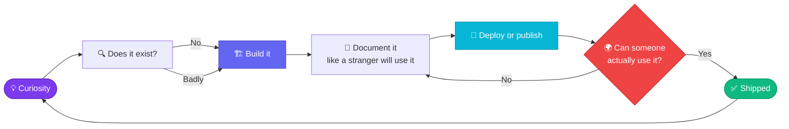

<!-- ══════════════════════════════════════════════════════════════════════
     KAWISH · GITHUB PROFILE README
     Theme: "codedna ./kawish" — the profile is a scan of its own author
     ══════════════════════════════════════════════════════════════════════ -->

<div align="center">


<br/>

<a href="https://github.com/kawishjaykar91-beep?tab=followers"></a>
<a href="https://www.npmjs.com/package/@kawishjaykar/codedna"></a>
<a href="https://kawishjaykar91-beep.github.io/nasa-apod/"></a>


</div>

<br/>

## 🧬 `codedna ./kawish`

> I built a CLI that scans a codebase and prints a health report. So here's mine.

```text
                   ______          __     ____  __  __ __
                  / ____/___  ____/ /__  / __ \/ | / /   |
                 / /   / __ \/ __  / _ \/ / / /  |/ / /| |
                / /___/ /_/ / /_/ /  __/ /_/ / /|  / ___ |
                \____/\____/\____/\___/_____/_/ |_/_/  |_|

 📦 Developer         Kawish  ·  @kawishjaykar91-beep
 🌍 Location          Earth, mostly
 💻 Primary Language  TypeScript
 ⚛  Stack             Node · Vite · Vanilla JS · Python
 📁 Public Repos      3          🚀 Shipped to production   2
 📦 npm Packages      1          🌐 Live deployments        1
 🔁 CI/CD Pipelines   1          💤 Abandoned projects      0

 ──────────────────────────────────────────────────────────────
 ❤️  HEALTH                                               100%
 ──────────────────────────────────────────────────────────────
   ✔ Ships finished work        ✔ Writes real documentation
   ✔ Deploys, not just commits  ✔ Publishes for others to use
   ✔ Licenses properly (MIT)    ✔ Automates the boring parts

 ──────────────────────────────────────────────────────────────
 ⚠  WARNINGS
 ──────────────────────────────────────────────────────────────
   1 × TODO: sleep
   ∞ × ideas queued for later

 ──────────────────────────────────────────────────────────────
 🧬 VERDICT
 ──────────────────────────────────────────────────────────────
   Small repo count, high completion rate — a rare ratio.
   Every project here is finished, documented and reachable
   by a stranger. Keep shipping. The graph will catch up.
 ──────────────────────────────────────────────────────────────
```

<div align="center">

</div>

## 🚀 Things I've Shipped

<table>
<tr>
<td width="50%" valign="top">

<a href="https://github.com/kawishjaykar91-beep/CodeDNA">
  
</a>

**🧬 CodeDNA** — a CLI that X-rays any codebase in under a second: framework detection, language breakdown, health score, code smells, verdict. **No AI, no cloud, no config.** Published on npm.

```bash
npm i -g @kawishjaykar/codedna && codedna
```


</td>
<td width="50%" valign="top">

<a href="https://github.com/kawishjaykar91-beep/nasa-apod">
  
</a>

**🌌 NASA APOD** — a cinematic window into NASA's Astronomy Picture of the Day archive, with a **Time Machine** for any date, URL history sync, full a11y and reduced-motion support.

**[→ Launch it live](https://kawishjaykar91-beep.github.io/nasa-apod/)**


</td>
</tr>
</table>

<br/>

## 🛠️ Stack

<div align="center">

<br/>


</div>

<table>
<tr><td width="20%"><b>Languages</b></td><td>TypeScript · JavaScript · Python · HTML · CSS</td></tr>
<tr><td><b>Runtime</b></td><td>Node.js · Vite · npm</td></tr>
<tr><td><b>Ship &amp; Deploy</b></td><td>Git · GitHub Actions · GitHub Pages · npm registry</td></tr>
<tr><td><b>Working on</b></td><td>Deeper static analysis · Plugin architectures · API-driven UIs</td></tr>
</table>

<br/>

## 🧠 How I Build



<details>
<summary><b>🎯 The rule I actually follow</b></summary>

<br/>

> **A project isn't done when it works on my machine. It's done when a stranger can install it, understand it, and use it without asking me a question.**

That's why there are only three repos here. Each one has a README written for someone who has never met me, a license, and a way to actually run it. I'd rather have three finished things than thirty half-built ones.

</details>

<details>
<summary><b>📡 What I'm building next</b></summary>

<br/>

| Project | Status |
|---|---|
| CodeDNA — JSON + HTML report export | 🔨 In progress |
| CodeDNA — plugin system for custom analyzers | 📋 Designing |
| Deeper complexity & dependency metrics | 🧪 Researching |
| More API-driven interface experiments | 💭 Ideating |

</details>

<br/>

## 📊 The Numbers

<div align="center">


</div>

<br/>

## 🐍 Watch the Contributions Get Eaten

<div align="center">

<picture>
  <source media="(prefers-color-scheme: dark)" srcset="https://raw.githubusercontent.com/kawishjaykar91-beep/kawishjaykar91-beep/output/github-snake-dark.svg" />
  <source media="(prefers-color-scheme: light)" srcset="https://raw.githubusercontent.com/kawishjaykar91-beep/kawishjaykar91-beep/output/github-snake.svg" />
  
</picture>

<sub><i>Requires the one-time workflow setup — see the note below this README.</i></sub>

</div>

<br/>

## 🤝 Find Me

<div align="center">

<a href="https://github.com/kawishjaykar91-beep"></a>
<a href="https://www.npmjs.com/~kawishjaykar"></a>
<a href="https://kawishjaykar91-beep.github.io/nasa-apod/"></a>

<br/><br/>


</div>

<br/>

<div align="center">


### ⭐ If something here was useful, a star costs nothing and means a lot.


</div>
